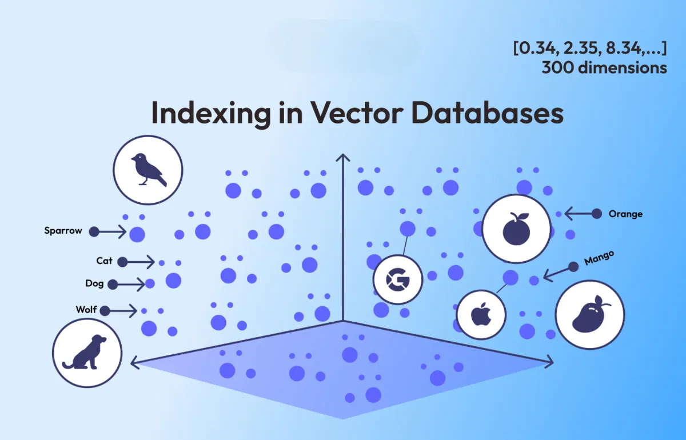
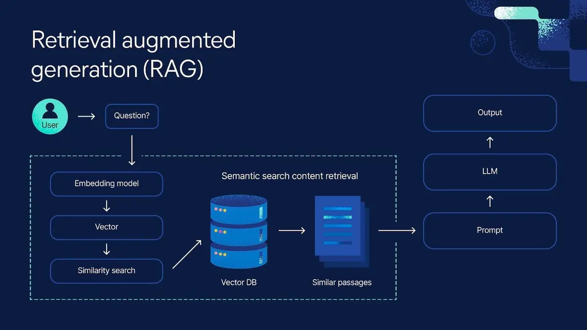

# RAG Architecture & Best Practices
*A comprehensive guide to Retrieval-Augmented Generation*

---

## Processing Internal Data with RAG
### Solving Traditional LLM Limitations

**Key LLM Challenges:**
- No knowledge of internal/organizational data
- Hallucination - generating fabricated information
- Inability to update knowledge with new information
- Lack of specialized domain context

**→ The Need for RAG (Retrieval-Augmented Generation)**

---

## CORE FOUNDATION: EMBEDDING & VECTOR DATABASE

### Embedding
- Vectorization of text data
- Semantic conversion to numerical representations
- Contextual information encoding

> Vectors: A list of numbers representing the meaning of words.

> Embeddings: A process of converting raw data into a form that can measure the similarity while reducing the size of the data.

### Vector Database
- Storage and management of embeddings
- Similarity-based searching
- Cosine Similarity, Euclidean Distance metrics
- Foundation for Semantic Search & RAG systems

---

## WHAT IS RAG?
### Retrieval-Augmented Generation

**Core Pipeline:**

- **RAG Concept** = **Retrieval + Augmented + Generation**
  - 4 Main Phases:
    1. **Indexing** - Initialize Base Knowledge
    2. **Retrieval** - Find relevant information
    3. **Augmented** - Enhance prompt with context
    4. **Generation** - LLM generates response

- **How It Works**:
  - Combines search capabilities + language generation power
  - Real-world use case: *internal documentation chatbot*

---

## KEY PHASES IN RAG ARCHITECTURE

### 3.1 Indexing Phase
- **Process**:
  - Data extraction (PDF, HTML, API sources)
  - Optimal chunking (OCR - Optical Character Recognition)
  - Embedding generation
  - VectorDB storage
- **Demo Code**: Indexing data into LanceDB

### 3.2 Retrieval Phase
- **Process**:
  - Query → Embedding → Vector search
  - Similarity metrics (Cosine, Euclidean)
  - TopK and filtering strategies
- **Demo Code**: Search queries → return relevant chunks

### 3.3 Augmented Phase
- **Process**:
  - Combine context + query into enhanced prompt
  - Prompt formatting techniques
- **Comparison**: Basic prompt vs. context-enriched prompt

### 3.4 Generation Phase
- **Process**:
  - Feed enhanced prompt to LLM
  - Model configuration (temperature, system role)
- **Demo Code**: Generate responses from context

---

## RAG Architecture Patterns

**8 Key Architecture Patterns:**
1. **Naive RAG** - Basic retrieval and generation
2. **Multimodal RAG** - Handles multiple data types
3. **HyDE** - Hypothetical Document Embeddings
4. **Corrective RAG** - Self-correcting mechanisms
5. **Graph RAG** - Knowledge graph integration
6. **Hybrid RAG** - Combined retrieval methods
7. **Adaptive RAG** - Dynamic strategy selection
8. **Agentic RAG** - Autonomous agent integration

**Analysis:**
- Advantages and limitations of each approach
- Mapping to principle groups (single-shot, multi-shot, hybrid)
- Use case recommendations

---

## DEMO: TUTORIAL CHATBOT WITH RAG

### Scenario
- Internal guide support chatbot
- Data source: Tutorial documents
- Sample query: "How to create resources?"

### Pipeline Execution:
1. **Indexing**: Document chunking → embedding → VectorDB
2. **Retrieval**: Find relevant tutorial content
3. **Augmented**: Enhance with authentication context
4. **Generation**: LLM provides detailed response

---

## BEST PRACTICES & COMMON PITFALLS

### Key Considerations:
- **Chunking Strategy & TopK Tuning**
  - Optimal chunk sizes for different content types
  - TopK parameter optimization

- **Model Selection**
  - Choosing appropriate embedding models
  - LLM selection based on use case

- **VectorDB Optimization**
  - Metadata filtering strategies
  - Efficient indexing and querying

- **Performance Management**
  - Token limits and context window optimization
  - Context trimming techniques

### Implementation Checklist:
- [ ] Define chunking strategy
- [ ] Select embedding model
- [ ] Configure VectorDB metadata
- [ ] Optimize TopK parameters
- [ ] Implement prompt templates
- [ ] Set up monitoring and evaluation

---

## MINI PROJECT DEMONSTRATION

### Technical Stack:
- **Mini Pipeline**: Index + Retrieval + Augment + Generation
- **Technology**: JavaScript + OpenAI + LanceDB
- **Local Setup**: LMstudio for local LLM/Embedding

### Workshop Activities:
- Team script execution session
- Experiment with parameter variations:
  - Query modifications
  - TopK adjustments
  - Prompt template changes
- Observe and analyze result differences

---

## Next Steps & Application

### Discussion Topics:
- Team questions and technical clarifications
- Identifying suitable RAG architecture for your project
- Resource planning and technical requirements

### Implementation Pathway:
1. **Proof of Concept** → **MVP** → **Production**
2. **Evaluation Criteria**: Performance, accuracy, scalability
3. **Success Metrics**: Response quality, user satisfaction, efficiency

---

## Q&A

### Reference Materials:
- [Vector Database Fundamentals](https://200lab.io/blog/vector-database-la-gi)
- [RAG Comprehensive Guide](https://200lab.io/blog/rag-la-gi)
- [Retrieval Augmented Generation (RAG) in Azure AI Search](https://learn.microsoft.com/en-us/azure/search/retrieval-augmented-generation-overview?tabs=docs)
- [8 Retrieval Augmented Generation](https://humanloop.com/blog/rag-architectures)
- [OCR - Optical Character Recognition](https://learn.microsoft.com/en-us/azure/ai-services/computer-vision/overview-ocr)

### Additional Resources:
- Code repositories and documentation
- Performance benchmarking tools
- Community forums and support channels

## Thank You!
*Let's build intelligent, context-aware applications together!*