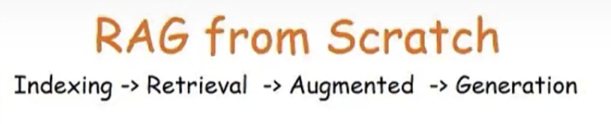
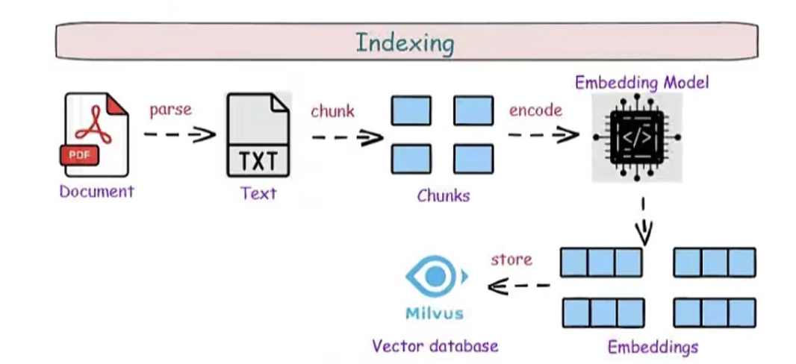
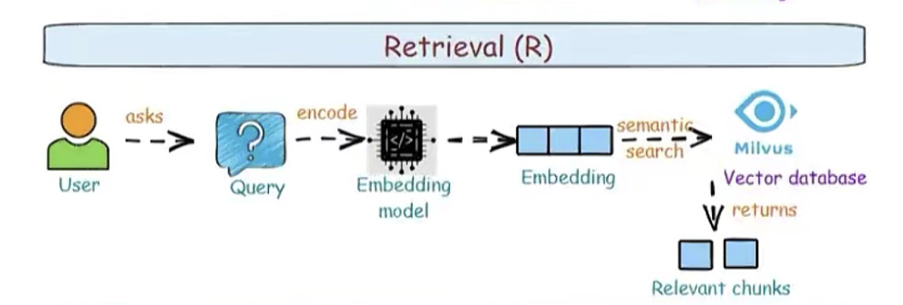
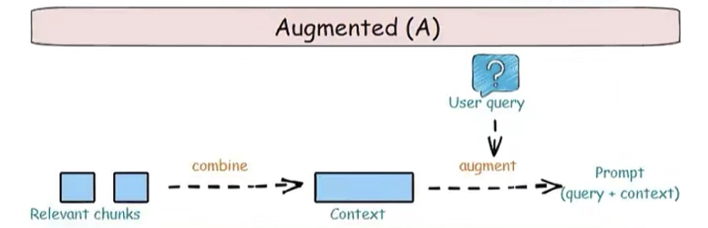
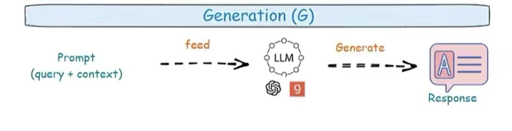
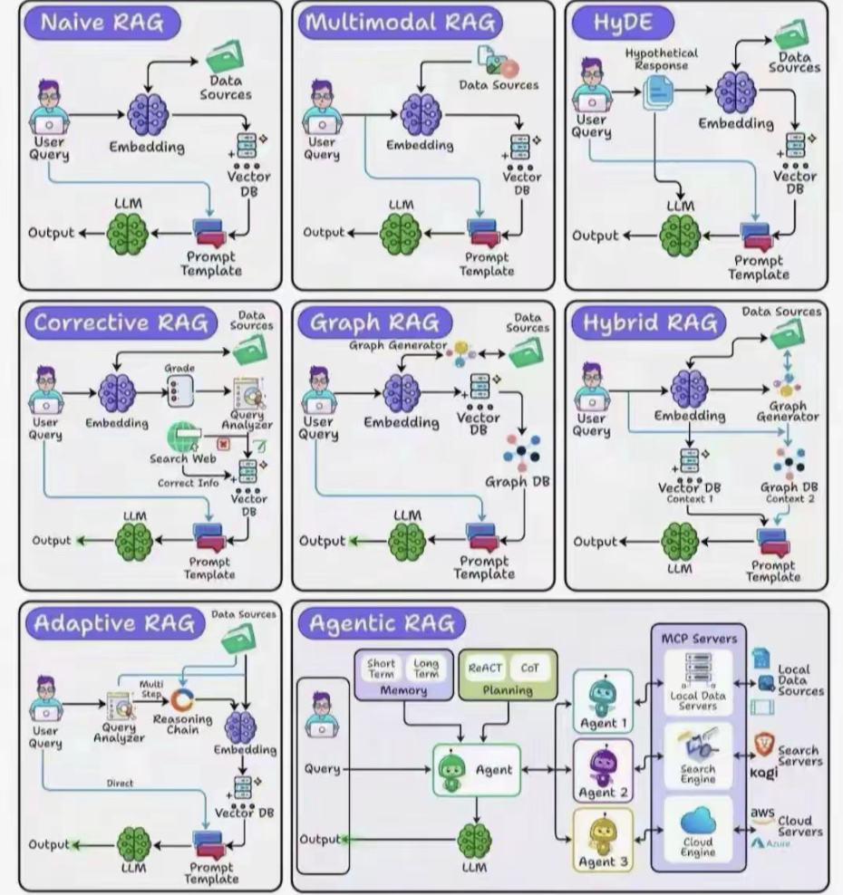

# Agenda Sharing – RAG Architecture & Best Practices

## 1. Mở đầu & Mục tiêu buổi chia sẻ
- **Thời lượng**: 5 phút
- **Nội dung**:
  - Giới thiệu bối cảnh AI trong dự án
  - Lý do team cần RAG
  - Mục tiêu: Hiểu và áp dụng RAG vào hệ thống của mình
- **Hoạt động**:  
  - Câu hỏi mở: “Theo bạn, LLM hiện tại có thể trả lời về dữ liệu *private* của công ty không? Vì sao cần RAG?”

---

## 2. RAG là gì? Tổng quan về các Phase
- **Thời lượng**: 10 phút
- **Nội dung**:
  - Khái niệm RAG = **Retrieval + Augmented + Generation**
  - 4 Phase chính:
    1. **Indexing**
    2. **Retrieval**
    3. **Augmented**
    4. **Generation**
  - Minh họa pipeline tổng quan (flow từ User → LLM)
- **Hoạt động**:
  - Vẽ sơ đồ pipeline trên bảng / slide
  - Trích dẫn case thực tế: *chatbot tài liệu nội bộ*

---

## 3. Dive Deep into Each Phase

### 3.1 Indexing Phase
- **Thời lượng**: 10 phút
- **Nội dung**:
  - Trích xuất dữ liệu (PDF, HTML, API)
  - Chunking hợp lý
  - Tạo embedding
  - Lưu vào VectorDB
- **Demo code**: index dữ liệu vào LanceDB duyệt bằng JavaScript.

### 3.2 Retrieval Phase
- **Thời lượng**: 10 phút
- **Nội dung**:
  - Query → Embedding → Vector search
  - Các metric similarity (Cosine, Euclidean)
  - TopK và filtering
- **Demo code**: search câu hỏi → trả về chunks

### 3.3 Augmented Phase
- **Thời lượng**: 5 phút
- **Nội dung**:
  - Ghép context + query thành prompt
  - Kỹ thuật formatting prompt
- **Hoạt động**: So sánh prompt “trần” vs prompt có context đầy đủ

### 3.4 Generation Phase
- **Thời lượng**: 5 phút
- **Nội dung**:
  - Feed prompt vào LLM
  - Cấu hình model (temperature, system role)
- **Demo code**: Sinh câu trả lời từ context

---

## 4. Các Kiến trúc RAG phổ biến
- **Thời lượng**: 15 phút
- **Nội dung**:
  - 8 kiến trúc trong hình minh họa:
    1. Naive RAG
    2. Multimodal RAG
    3. HyDE
    4. Corrective RAG
    5. Graph RAG
    6. Hybrid RAG
    7. Adaptive RAG
    8. Agentic RAG
  - Mô tả ưu / nhược điểm
  - Mapping theo nhóm nguyên lý (single-shot, multi-shot, hybrid)

  
- **Hoạt động**:
  - Case study: Chọn kiến trúc phù hợp cho dự án team đang làm

---

## 5. Best Practices & Pitfalls
- **Thời lượng**: 10 phút
- **Nội dung**:
  - Chunking và TopK tuning
  - Lựa chọn model embedding
  - Metadata filtering trong VectorDB
  - Giới hạn token & context trimming
- **Hoạt động**:
  - Checklist: triển khai RAG cho dự án

---

## 6. Demo Mini Project
- **Thời lượng**: 15 phút
- **Nội dung**:
  - Mini pipeline: Index + Retrieval + Augment + Generation
  - JavaScript + OpenAI + LanceDB
- **Hoạt động**:
  - Cùng team chạy script
  - Thử thay đổi query / TopK / prompt và quan sát kết quả khác biệt

---

## 7. Q&A + Định hướng áp dụng
- **Thời lượng**: 10 phút
- **Nội dung**:
  - Giải đáp thắc mắc của team
  - Xác định kiến trúc RAG phù hợp cho dự án`
  - Next steps: PoC → MVP → Production

---

## 📦 Tài liệu & Chuẩn bị trước buổi
- Slide pipeline RAG
- OCR là gì?
- Sơ đồ 8 kiến trúc RAG (từ hình minh hoạ)
- Demo code Naive RAG + Corrective RAG
- Tài liệu tóm tắt VectorDB vs GraphDB
- Checklist cấu hình RAG cho dự án

---

## 💡 Mẹo chia sẻ hiệu quả
- Updating ....